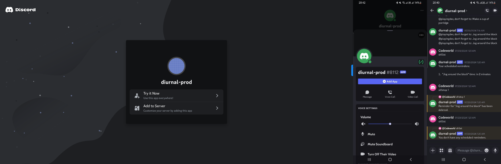

# diurnal-help-discord-bot

A Discord bot with various interactive features to enhance your server experience.



[Add diurnal-help on Discord ](https://discord.com/oauth2/authorize?client_id=1261499835228487680)

# Built With 
- Nodejs
- [Discordjs](https://discordjs.guide/)
- [Node Cron](https://www.npmjs.com/package/node-cron)
- OpenAI

## Features

- **Welcome Message:** Greets new members when they join the server.
- **Send Me a Quote:** Provides a random inspirational quote on demand.
- **"Buy Me a Coffee" Functionality:** Allows users to support the bot creator with donations.
- **Happy New Year Message:** Automatically sends a celebratory message on New Year's Day.
- **Happy Birthday Message:** Automatically sends a celebratory message on your special day.
- **Task Reminder:** Helps users set and receive reminders for their tasks.
- **ChatGPT Prompt:** Integrates with ChatGPT to answer questions or prompts.

## Getting Started

### Prerequisites

- Node.js
- npm
- Discord account

### Installation

1. Clone the repository:
   ```bash
   git clone https://github.com/Bluette1/diurnal-help-discord-bot.git
   cd diurnal-help-discord-bot
   ```


2. Install dependencies:
```bash

  yarn install

```


3. Set up your .env file with your Discord bot token:

  ```bash 
    env


    TOKEN=your discord_bot_token
    CLIENT_ID=the_discord_client_id
    BOT_OWNER_ID=owner_discord_id
    OPENAI_API_KEY=your_open_ai_api_key
    UPDATE_COMMANDS=0 | 1
    BOT_ID=bot_id

```


4. Run the bot:
  
  ```bash

  yarn start
```

### Usage

Add the bot to your Discord server using the invite link.
Use commands to interact with the bot:

- /ping: responds with "pong"
- sh!list: Checks the current list of reminders.
- sh!addpayment [@your_discord_username] [$Amount]: records a donation made
- sh!stop [task_number]: Stops the given task.
- /quote: Receives an inspirational quote.
- sh!newyear: Checks if today is New Year's Day and sends a message.
- sh!birtday [Month] [Day]: Checks if today is your birtday and sends you a message.
- sh!remind [task] at [time]: Sets a reminder for a task at given time.
- sh!remind [task] [time_in_x_minutes]: Sets a reminder for a task in x minutes.
- sh!remind repeat [task] [time_in_x_minutes]: Sets a reminder for a task every x minutes.

**Default** (e.g. "Send me a joke"): Interacts with ChatGPT for an AI response.

### Contributing

Contributions are welcome! Please fork the repository and submit a pull request.

### License

This project is licensed under the MIT License.

### Contact

For any questions or feedback, please contact marylene.sawyer@gmail.com

Feel free to customize it further based on your specific implementation and additional details.
